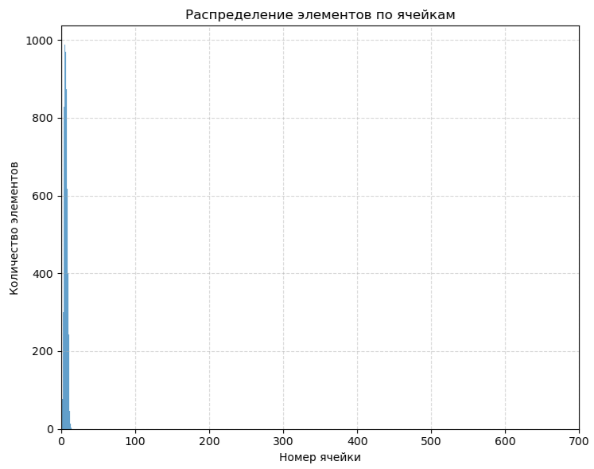

# Исследование работы хэш-таблицы с разрешением коллизий методом цепочек и ее низкоуровневая оптимизация

Гудчиков Максим, 1 курс ФРКТ МФТИ

[Хэш-таблица](https://khalilstemmler.com/blogs/data-structures-algorithms/hash-tables/) - это такая структура данных, в которой вставка, поиск и удаление элемента происходит за $O(1)$ в лучшем случае. Выглядит она так:
                                    
                                    


### Общий принцип ее работы

Общий принцип ее работы таков: пусть мы вставляем элемент в хеш-таблицу. Как выбирается ячейка хэш-таблицы, в которую нужно вставить элемент? На вход хэш-функции поступает ключ (в данном случае слово), из которого хэш-функция получает некое числовое значение. Это числовое значение и будет являться номером ячейки хэш-таблицы, в которую следует положить элемент. 

Для поиска и удаления алгоритм выбора ячейки хэш-таблицы такой же.

### Устройство нашей хэш-таблицы 

В качестве ячейки хэш-таблицы будет использоваться самописный двусвязный список, обладающий свойством локальности и дружественный к кешу. Сама хэш-таблица будет представлять из себя массив таких двусвязных списков. 

Иногда возникает проблема, когда хеш-функция выдает одинаковое натуральное число для разных элементов. Такая ситуация называется коллизией. Для решения этой проблемы в нашем проекте мы будем производить линейный поиск по соответствующему списку, что позволяет находить нужный элемент даже при коллизии.  

Ниже представлена картинка, которая отображает вышеизложенную информацию. 


#### Функции нашей хэш-таблицы

Удаление элемента из хэш-таблицы нас интересовать не будет, такой функции поддерживаться не будет. 

Будет поддерживаться вставка и поиск элемента в хэш-таблице. 
В качестве элемента будет выступать слово. 

Вставка будет происходить таким образом, чтобы два одинаковых слова в хэш-таблице не встречалось (в одной ячейке не может быть два одинаковых слова). Следует уточнить, что значение, полученное хэш-функцией, может превосходить размер хэш-таблицы. Чтобы решить эту проблему, номер ячейки хэш-таблицы будет являться остатком от деления значения хэш-функции на размер хэш-таблицы.

Поиск элемента будет происходить по общему алгоритма поиска в хэш-таблице.


> [!WARNING]
> Программа вовсе не скомпилируется, если ваш процессор не поддерживает SIMD инструкций стандарта AVX2. 

## Первая часть работы

### Цель

Цель первой части работы заключается в исследовании распределения значений восьми хэш-функций. Подробнее см. ниже.

### Метод исследования

Для исследования будем использовать нашу хэш-таблицу. В качестве данных для вставки в хэш-таблицу возьмем набор слов, использующихся в произведении У.Шекспира "Гамлет, принц датский" (см. [hamlet.txt](src/hamlet.txt)). Это позволит нам исследовать поведение хэш-функций не на искусственно сгенерированных данных, а на реальных, что лучше. После вставки всех слов в хэш-таблицу необходимо будет сделать дамп заселенности хэш-таблицы. Используя этот дамп, будем строить диаграмму заселенности хэш-таблицы.

Работать будем с лоад-фактором (или заселенностью) хэш-таблицы около 4. Это позволит нам лучше исследовать поведение хэш-функций, так как диапазон значений хэш-функций (в среднем) больше размера хэш-таблицы.

### Скрипт, считающий количество слов в тексте

Мой скрипт будет из текста делать файл, в котором на каждой строке будет находиться одно слово, при этом убирая различные знаки препинания. Важно отметить, что слова в выходном файле скрипта могут повторяться.

В текстовом файле, который создал мой скрипт из текста произведения У.Шекспира "Гамлет, принц датский", примерно 5500 уникальных слов.

### Размер хэш-таблицы

Стоит обговорить и размер хэш-таблицы. Ее размер должен быть простым числом. Почему? 

Допустим, что хэш-функция чаще всего выдает значения, кратные 100. Тогда в списках с индексами, кратными 100, будет в среднем больше элементов. Предположим, что размер хэш-таблицы будет также равен 100. Возьмем списки с номерами 200, 300, ... Остатки от деления номеров этих списков на размер хэш-таблицы будут совпадать. Следовательно, их элементы попадут в одну ячейку хэш-таблицы, и длина списка, соответствующего этой ячейке, будет равна сумме длин исходных списков. Поэтому в этой ячейке будет еще больше элементов, и на гистограмме будет усиливаться пик заселенности в этой ячейке. Строго говоря, усиление будет происходить для любых пиков, повторяющихся с периодом k, если у k и размера хэш-таблицы будет общий множитель. Чтобы минимизировать такую вероятность, размер хэш-таблицы стоит выбирать как простое число. Это позволит избежать усиления пиков заселенности.  

В нашем случае для того, чтобы лоад-фактор хэш-таблицы был $\simeq 4$, размер хэш-таблицы будет равен 1387.

### Дисперсия распределения элементов в хеш-таблице вычисляется по формуле:

$$
\sigma^2 = \frac{1}{N-1} \sum_{i=0}^{N-1} (x_i - \mu)^2
$$

**Где:**
- $N$ - размер хеш-таблицы (количество ячеек)
- $x_i$ - количество элементов в $i$-й ячейке
- $\mu$ - среднее количество элементов на ячейку (Load Factor):

$$
\mu = \frac{1}{N} \sum_{i=0}^{N-1} x_i
$$

###  Влияние дисперсии хеш-функции на распределение

1. **Низкая дисперсия** ($ \sigma^{2} \approx \mu $ ):
   - Равномерное распределение элементов

2. **Высокая дисперсия** ($ \sigma^{2} >> \mu $ ):
   - Неравномерное заполнение ячеек

### Исследуемые хэш-функции

### Первая хэш-функция (`ConstHash()`)

Код первой хэш-функции выглядит так:

<details>
<summary> Показать код ConstHash</summary>

```c
uint32_t ConstHash (const HashTableElem_t value) 
{
    return 0;
}
```

То есть она всегда возвращает 0 вне зависимости от входной строки.
</details>

Диаграмма распределения такой хэш-функции:


Дисперсия такого распределения:
```
Const hash:
variance of elements in hash table = 21682.95
```

Понятно, что эта функция никуда не годится.

### Вторая хэш-функция (`FirstSymHash()`)
                       
<details>
<summary>Код второй хэш-функции:</summary>

```c
uint32_t FirstSymHash (const HashTableElem_t value) 
{
   return ((int64_t) value[0]);
}
```

Она возвращает ASCII-код первой буквы слова. 
</details>


Диаграмма распределения такой хэш-функции:


<!--  -->

Дисперсия такого распределения:
```
First symbol hash:
variance of elements in hash table = 872.20
```

По сравнению с первой хэш-функцией уже лучше, однако такое распределение все так же никуда не годится.

### Третья хэш-функция (`LenHash()`)
<details>
<summary>Код третьей хэш-функции: </summary>

```c
uint32_t LenHash (const HashTableElem_t value) 
{
   return ((uint32_t) strlen (value));
}
```

Она возвращает длину слова.
</details>

Диаграмма распределения такой хэш-функции:



<!--  -->

Видно, что значения 40 и более хэш-функция не возвращает, поэтому построим приближенную по оси x гистограмму: 


Дисперсия такого распределения:
```
Length hash:
variance of elements in hash table = 2924.71
```

Сильно неравномерная хэш-функция с ярко выраженным пиком в начале. Не стоит ее использовать. 

### Четвертая хэш-функция (`AsciiSumHash()`)

<details>
<summary>Код четвертой хэш-функции:</summary>

```c
uint32_t AsciiSumHash (const HashTableElem_t value) 
{
   uint32_t ascii_codes_sum = 0;
   uint32_t word_length     = (uint32_t) strlen (value);

   for (size_t i = 0; i < word_length; i++)
        ascii_codes_sum += value[i];

   return ascii_codes_sum;
}
```
Она возвращает сумму всех ASCII-кодов слова.
</details>


Диаграмма распределения такой хэш-функции:


Дисперсия такого распределения:
```
Ascii sum hash:
variance of elements in hash table = 27.97
```

Отличная хэш-функция, судя по дисперсии. Но если обратить внимание на пики, то отличной ее назвать язык не повернется. Но самое главное, что эта функция коварна: она ограничена сверху, так как не существует таких длинных слов с большой суммой. Это приводит к тому, что теряется главное свойство хэш-таблицы: увеличивая ее размер, мы уменьшаем лоад-фактор и ускоряем поиск. Масштабирование по размеру в данном случае невозможно. 

<!-- #### Часть 2

Исследование при размере хэш-таблицы = 101.

Диаграмма распределения такой хэш-функции:

    

Дисперсия такого распределения:
```
Ascii sum hash, hash table capacity = 101:
variance of elements in hash table = 463.25 
```

Распределение не совсем равномерное, но лучше всех рассмотренных выше хэш-функций. Ее можно было бы использовать для хэш-таблиц размером до ~100 ячеек, но из-за гигантского лоад-фактора хэш-таблицы лучше не использовать эту хэш-функцию. -->

### Пятая хэш-функция (`AsciiSumDivLenHash()`)
                      
<details>
<summary>Код пятой хэш-функции: </summary>

```c
uint32_t AsciiSumDivLenHash (const HashTableElem_t value) 
{
   uint32_t ascii_codes_sum = 0;

   uint32_t word_length     = (uint32_t) strlen (value);

   for (size_t i = 0; i < word_length; i++)
        ascii_codes_sum += value[i];

   return ((uint32_t) (ascii_codes_sum / word_length));
}
```

Она возвращает округленный до целого результат деления суммы всех ASCII-кодов слова на длину слова.
</details>

Диаграмма распределения такой хэш-функции:


Дисперсия такого распределения:
```
Ascii sum div len hash:
variance of elements in hash table = 1484.70
```

Видно, что эта хэш-функция обладает ярко выраженным пиком и далеко не равномерным распределением. Не стоит ее использовать.

### Шестая хэш-функция (`RorHash()`)

<details>
<summary>Код шестой хэш-функции: </summary>

```c
uint32_t RorHash (const HashTableElem_t value) 
{
   uint32_t word_length = (uint32_t) strlen (value);

   if (word_length == 0)
        return 0;

   uint32_t hash = value[0];

   for (size_t i = 1; i <= word_length; i++)
   {

        hash = MyRor (hash, 1);
        hash ^= value[i];
   }

   return hash;
}
```

`MyRor()` - функция, выполняющая циклический побитовый сдвиг вправо. Так, например, `MyRor(a, b)` выполнит циклический сдвиг вправо на `b` позиций над числом `a` и вернет получившееся число.
</details>

Исследование этой хэш-функции будет производиться в двух случаях:
1. При размере хэш-таблицы = `1387` 
2. При размере хэш-таблицы = `787`  

### Часть 1

Иследование при load_factor = $ \approx 4.$ 

Диаграмма распределения такой хэш-функции:


Дисперсия такого распределения:
```
Ror hash:
variance of elements in hash table = 11.80
```

График показывает крайне неравномерное распределение с большими пустыми областями и отдельными резкими пиками. Такую хэш-функцию (ROR) использовать не рекомендуется — она даёт высокую вероятность коллизий и плохо заполняет таблицу

### Часть 2

Иследование при load_factor = 7

Диаграмма распределения такой хэш-функции:


Дисперсия такого распределения:
```
Ror hash:
variance of elements in hash table = 21.34 
```

Хэш-функция обладает не очень равномерным распределением. В принципе, использовать ее можно, но можно найти вариант лучше. 

### Седьмая хэш-функция (`RolHash()`)

Код седьмой хэш-функции ничем не отличается от шестой за исключением того, что вместо `MyRor` в ней используется `MyRol`:

<details>
<summary>Код шестой хэш-функции: </summary>

```c
uint32_t RolHash (const HashTableElem_t value) 
{
   uint32_t word_length = (uint32_t) strlen (value);

   if (word_length == 0)
        return 0;

   uint32_t hash = value[0];

   for (size_t i = 1; i <= word_length; i++) 
   {

        hash = MyRol (hash, 1);
        hash ^= value[i];
   }

   return hash;
}
```

`MyRol()` - функция, выполняющая циклический побитовый сдвиг влево.
</details>

Диаграмма распределения такой хэш-функции:


Распределение выглядит довольно равномерно, оно без особо ярко выраженных пиков. Функция пригодна к использованию в реальных задачах.  

Дисперсия такого распределения:
```
Rol hash:
variance of elements in hash table = 4.62
```


### _Интересный факт про оптимизацию `MyRol()` и `MyRor()`_

Оказывается, функции `MyRor()` и `MyRol()` компилятор при любом флаге оптимизации может свернуть в ассемблерные команды ror и rol соответственно [(пример для -O3)](https://godbolt.org/z/7evqzfPMc):


### Восьмая хэш-функция (`MurmurHash()`)

В качестве восьмой хэш-функции будет выступать MurmurHash3_32. Сид у такой хэш-функции будет постоянен и равен 0.

<details>
<summary>Код этой хэш-функции: </summary>

```c
uint32_t MurmurHash (const HashTableElem_t value) 
{
   const uint8_t *key  = (const uint8_t *) value;

   const uint32_t len  = (size_t) strlen ((char *) key);

   uint32_t hash             = 0;
   uint32_t four_bytes_block = 0;

   for (uint32_t i = len / 4; i > 0; i--) 
   {
      memcpy (&four_bytes_block, key, sizeof (uint32_t));

      key += sizeof (uint32_t);

      four_bytes_block *= MAGIC_NUM_1;
      four_bytes_block  = MyRol (four_bytes_block, MAGIC_NUM_FOR_ROL_1);
      four_bytes_block *= MAGIC_NUM_2;

      hash ^= four_bytes_block;
      hash  = MyRol (hash, MAGIC_NUM_FOR_ROL_2);
      hash  = hash * MAGIC_NUM_6 + MAGIC_NUM_3;
   }

   four_bytes_block = 0;

   for (uint32_t i = len % 4; i > 0; i--) 
   {
      four_bytes_block <<= 8;
      four_bytes_block  |= key [i - 1];
   }

   four_bytes_block *= MAGIC_NUM_1;
   four_bytes_block  = MyRol (four_bytes_block, MAGIC_NUM_FOR_ROL_1);
   four_bytes_block *= MAGIC_NUM_2;

   hash ^= four_bytes_block;

   hash ^= len;

   hash ^= (hash >> MAGIC_NUM_FOR_BIT_SHIFT_1);
   hash *= MAGIC_NUM_4;
   hash ^= (hash >> MAGIC_NUM_FOR_BIT_SHIFT_2);
   hash *= MAGIC_NUM_5;
   hash ^= (hash >> MAGIC_NUM_FOR_BIT_SHIFT_1);

   return hash;
}
```
</details>

Диаграмма распределения такой хэш-функции:


Хэш-функция показывает равномерное распределение и отсутствие пиков. Отличная хэш-функция для реальных задач.

Дисперсия такого распределения:
```
Murmur hash:
variance of elements in hash table = 4.00
```

Можно заметить, что эта хэш-функция показывает лучшее распределение среди представленных в этой работе.


### Девятая хэш-функция (`Crc32Hash()`) 

<details>
<summary>Код восьмой хэш-функции: </summary>

```c
uint32_t Crc32Hash (const HashTableElem_t value) 
{
   uint32_t       crc = 0xFFFFFFFF;
   const uint8_t* ptr = (const uint8_t*) value;
    
   while (*ptr) 
        crc = crc_table [(crc ^ *ptr++) & 0xFF] ^ (crc >> 8);

   return crc ^ 0xFFFFFFFF;
}
```
</details>

Диаграмма распределения такой хэш-функции:
                                          


Дисперсия такого распределения:
```
Crc32 hash:
variance of elements in hash table = 3.83
```

График распределения показывает равномерное заполнение ячеек без резких выбросов, а дисперсия 3.83 при лоад факторе 4 подтверждает хорошую сбалансированность

### Вывод о распределениях этих хэш-функций

Таблица дисперсий исследуемых хэш-функций:

| Хэш-функция           | Дисперсия           |
| :-------------------------: | :-----------------: |
| `ConstHash()`                              | $21683$  |
| `LenHash()`                                | $2925$  |
| `AsciiSumDivLenHash()`                     | $1485$  |
| `FirstSymHash()`                           | $872$  |
| `AsciiSumHash()`                           | $28.95$           |
| `RorHash()`, load_factor = 4               | $21$             |
| `RorHash()`, load_factor = 7               | $11$             |
| `RolHash()`                                | $4.62$           |
| `MurmurHash()`                             | $4.00$           |
| `Crc32()`                                  | $3.83$           |

Видно, что `ConstHash()` надо использовать ... примерно никогда. Дисперсия этой хэш-функции очень велика, и поиск в хэш-таблице будет выполняться очень медленно. Между тем, `MurmurHash()` и `Crc32` показали наименьший результат по дисперсии и примерно равный лоад-фактору. Это означает, что эти хэш-функции отлично подходят для ее применении в хэш-таблицах.


## Вторая часть работы

### Цель

Во второй части работы необходимо оптимизировать поиск по хэш-таблице (сделать его быстрее). Необходимо сделать как минимум 3 оптимизации, используя 3 разных инструмента:
- встроенный в C ассемблер;
- внешний ассемблер;
- intrinsic функции.

Производительность до и после оптимизаций будем замерять как профилировщиком, так и функцией `rdtsc()` (речь об этом пойдет ниже). Замеры будут производиться 15 раза для получение более точного результата и выяснения влияние погрешности на эти замеры.

В качестве компиляторов будут использоваться GCC версии 13.3.0 и CLANG версии 18.

### Особенности системы

Тестирование на производительность выполнялось на процессоре **12th Gen Intel(R) Core(TM) i5-1200H**, который поддерживает SIMD инструкции AVX2 и ниже.
Это означает, что процессор может выполнять векторные инструкции над 256 битами данных одновременно. 

Характеристики:

|     Характеристика             |  Значение     | 
|--------------------------------|---------------|
| Тактовая частота               | 2.5 ГГц       |
| Количество ядер                | 12             |
| Количество потоков             | 16             |
| Кэш 1 уровня                   | 960 КБ    |
| Кэш 2 уровня                   | 7,5 МБ    |
| Кэш 3 уровня                   | 18 МБ     |

При этом все измерения будем проводить при одном и том же диапазоне температур процессора от 35 до 50 градусов цельсия и при подключённом зарядном устройстве.

### Замеры производительности

В качестве средства профилирования будет использоваться **hotspot** — графический интерфейс для Linux **perf** 

| Команда                            | Описание                         |
|------------------------------------|----------------------------------|
| make hotspot                       | Запуск проекта с hotspot        |
| make perf-report                   | Консольный отчет perf           |
| make profile-gprof                 | Альтернативное профилирование (gprof) |
| make profile-valgrind              | Альтернативное профилирование (valgrind) |
| make rebuild                       | Обычная сборка                  |


<!-- Чтобы запустить проект с **hotspot**:
```bash
   make hotspot
```
Чтобы посмотреть консольный отчет perf
```bash
   make perf-report
```

Альтернативное профилирование
```bash
   make profile-gprof  # или profile-valgrind
```                                          

Обычная сборка
```bash
make rebuild
``` -->

Помимо этого, для замера производительности также будет использоваться `rdtsc()`. Она возвращает число тактов, прошедших с момента последнего сброса процессора. Функция `rdtsc()` до начала бенчмарка и сразу после него:

```c
int64_t cycle_start = __rdtsc();
 
benchmark_hash_table (&hash_table, &words_from_file);

int64_t cycle_end = __rdtsc();
```

Таким образом, мы сможем получить количество циклов, затраченных на бенчмарк. Сам бенчмарк будет производиться так: все слова, которые находятся в хэш-таблице, будут искаться 20000 раз:

```c
for (size_t i = 0; i < MAX_BENCHMARK_COMP_NUM; i++) // 20000 iterations
{ 
   char* volatile curr_word = (words->word);

   for (size_t word_num = 0; word_num < ((size_t) words->num_of_words); word_num++) 
   {

        find_status (hash_table, curr_word);
        curr_word += MAX_WORD_LENGTH;
   }
}
```

Многократный поиск слов позволит снизить влияние внешних факторов (системные прерывания, различные случайные промахи) на случайную погрешность времени бенчмарка.

### Сравнение GCC и CLANG

По ходу работы будем сравнивать скорость кода, который генерирует GCC и GLANG с помощью нашего бенчмарка. Для этого будем делать 2 таблицы с измерениями. В одной таблице будет производительность кода, сгенерированным GCC, в другой - сгенерированным CLANG. 


### Насчет троттлинга

Если во время бенчмарка начался троттлинг, то результаты измерений с помощью `rdtsc()` на самом деле недостоверны. Чтобы избежать пропуска тактов из-за перегрева процессора, возможное появление троттлинга во время бенчмарка будем отслеживать с помощью программы AIDA64.

По данным с сайта [hyperpc](https://hyperpc.ru/blog/service/normal-computer-temperature?ysclid=m9vkth44gv784374708), 105°C - это температура нашего процессора, выше которой кристалл умирает. На самом деле, троттлинг начинается с температуры 100°C. Будем следить, чтобы такая температура не достигалась при бенчмарке.

### Формулы для расчёта

Для серии из `N` измерений времени выполнения:

1. **Среднее арифметическое**:
   $$
   \bar{t} = \frac{1}{N}\sum_{i=1}^{N} t_i
   $$

2. **Стандартное отклонение** (характеризует разброс измерений):
   $$
   \sigma = \sqrt{\frac{\sum_{i=1}^{N} (t_i - \bar{t})^2}{N-1}}
   $$

3. **Случайная погрешность** (доверительный интервал для 95% вероятности):
   $$
   \Delta t = 2.145 \cdot \frac{\sigma}{\sqrt{N}}
   $$
   (коэффициент 2.145 соответствует нормальному распределению)


***ВСЕ расчеты и вычисления можно посмотреть*** в [data.md](data.md)

---

### Производительность до оптимизаций

Замерим производительность бенчмарком до различных оптимизаций. 

Результаты измерений скорости кода, сгенерированным `GCC` & `CLANG` :

| Компилятор | Затрачено циклов       | Относительная погрешность    |
| :-------------: | :--------------------: | :--------------------: |
| GCC               | $ (1.6685 \pm 0.0016) \cdot 10^{11} $ | 0.35% |
| CLANG             | $ (1.6649 \pm 0.0023) \cdot 10^{11} $ | 0.22% |


Заметим, что троттлинга во время теста не наблюдалось:


### GCC

Красным цветом обвел примерное диапазоны тестов, чтобы показать как себя чувствует процессор во время выволнения программы


### CLANG


Красным цветом обвел примерное диапазоны тестов, чтобы показать как себя чувствует процессор во время выволнения программы

**Получается, что код, сгенерированный GLANG, эффективнее, чем код, сгенерированный GCC?** Да, в данный момент это так.

---

### Про троттлинг в нашем случае

На самом деле, при дальнейших измерениях троттлинг не будет возникать, и следить за возможным его возникновением бессмысленно. Чтобы убедиться в этом, запустим тест в AIDA64 с такими параметрами на 20 мин: 


По прошествии 20 минут можно видеть, что никакого троттлинга при максимальной нагрузке не было, а температура во время стресс-теста не поднималась выше 55°C.


---


#### Профилировщик

Говоря о профилировщике, он показывает, что характерное время выполнения программы 54.28 s


Из них на бенчмарк ушло ~46 s (общее время минус собственное время для `test_hash_table_search()`):

### Что оптимизировать?

Попытаемся понять, что можно оптимизировать в этой программе. По показаниям профилировщика, большая часть времени уходит на поиск элемента в списке, а говоря точнее, на `strcmp()`:


Вторая функция, которую можно будет оптимизировать - это `MurmurHash()`:


В ней нельзя выделить только одно сильно затратное место, поэтому речь об ее оптимизации пойдет в несколько другом ключе.


### Внешний ассемблер

Будем оптимизировать `strcmp()` в функции поиска элемента в списке. Как это можно сделать?

Можно заметить, что слова, использующиеся в речи и письме, не содержат более 32 символов. Так как каждый символ - это 8 бит, то возникает идея реализовать `strcmp()` при помощи ymm регистров. Два слова можно положить в два ymm регистра (так как каждое слово не более 256 бит), после чего сравнить эти два регистра. Чтобы слова можно было класть в регистры и сравнивать, стоит каждое слово дополнять нулевыми байтами до размера в 32 байта. Это позволит не сравнивать мусор, находящийся после нулевого терминатора. Также это позволит избежать segmentation fault.

Тогда реализация `strcmp()` на внешнем ассемблере (nasm) будет выглядеть так:

```asm
section .text
global MyStrcmp

MyStrcmp:
    vmovdqu     ymm0,       [rdi]       
    vpcmpeqb    ymm1, ymm0, [rsi] 
    vpmovmskb   eax,  ymm1     

    xor         eax, 0xFFFFFFFF   
    jz          .equal  
              
    mov         eax, 1            
    ret

.equal:
    xor         eax, eax          
    ret
```

Результаты измерений скорости кода, сгенерированным `GCC` & `CLANG` :

| Компилятор | Затрачено циклов       | Относительная погрешность    |
| :-------------: | :--------------------: | :--------------------: |
| GCC               | $ (8.55 \pm 0.03) \cdot 10^{10} $ | 0.38% |
| CLANG             | $ (8.46 \pm 0.05) \cdot 10^{10} $ | 0.53% |


Видно, что производительность кода GCC стала уступать производительности кода CLANG.

Прирост производительности после замены стандартного `strcmp()` на `MyStrcmp()`колоссальный: он составляет x $1.95$
по сравнению с производительностью программы без оптимизаций.

По данным профилировщика видно, что среднее время работы программы сократилось до примерно 27.66 секунд:


----
Теперь попробуем оптимизировать `strcmp` спомощью Intrinsic и потом сравним результаты

Тогда реализация `strcmp` на Intrinsic будет выглядеть так:

```c
inline int FastStrCmp(const char* a, const char* b) 
{
    uint64_t a8, b8;

    memcpy (&a8, a, 8);
    memcpy (&b8, b, 8);

    if (a8 != b8) return 1;

    __m256i av  = _mm256_loadu_si256 ((const __m256i*)a);
    __m256i bv  = _mm256_loadu_si256 ((const __m256i*)b);
    __m256i cmp = _mm256_cmpeq_epi8  (av, bv);

    return _mm256_movemask_epi8 (cmp) ^ 0xFFFFFFFF;
}
```

Результаты измерений скорости кода, сгенерированным `GCC` & `CLANG` :

| Компилятор | Затрачено циклов       | Относительная погрешность    |
| :-------------: | :--------------------: | :--------------------: |
| GCC               | $ (8.03 \pm 0.06) \cdot 10^{10} $ | 0.71% |
| CLANG             | $ (7.96 \pm 0.06) \cdot 10^{10} $ | 0.74% |


В результате проведённых оптимизаций удалось добиться значительного ускорения работы функции strcmp() по сравнению с базовой версией без оптимизаций:

- Ассемблерная реализация (```MyStrcmp```) дала прирост производительности в `1.95` раз
- Реализация на Intrinsics (```FastStrCmp```) показала ещё лучший результат — прирост в ~2.08 раз

Таким образом, интринсики оказались быстрее ассемблерной версии примерно на 6-7%

### Почему Intrinsics быстрее?

Посмотрим как компилятор оптимизирует нашу программу через [GotBolt](https://godbolt.org/z/br7Pr7as4):

1. Сравнение первых 8 байт 


```
mov     rdi, QWORD PTR [rsi]   ; загрузили первые 8 байт строки `b`
cmp     QWORD PTR [rax], rdi   ; сравненили первых 8 байт строк `a` и `b`
jne     .L3                    ; if != —> к следующему элементу
```
Это ранний выход, если строки различаются в первых 8 байтах. В ассемблерной версии (```MyStrcmp```) такого нет — всегда загружается весь ymm-регистр, даже если строки различаются в первом байте.

***Экономия на ветвлении и пропуске ненужных загрузок***

2. Лучшее использует конвейрные процессы


Компилятор переставил инструкции так, чтобы минимизировать простои: это делается парарлельно с SIMD-операциями, чтобы задержки загрузки данных не тормозили конвейер.

В ассемблерной версии порядок строго линейный, и процессор может простаивать.

3. Улучшенная работа с памятью 

```
mov     rcx, QWORD PTR [rdi+8]   ; list->mainItems
lea     rdx, [rcx+rax*8]         ; вычисление адреса элемента
```

В find_list_elem компилятор предзагружает указатели: ассемблерной версии таких оптимизаций нет — каждый раз происходит полный доступ к памяти

***Меньше обращений к RAM, лучше использование кэша.***


### Встроенный в C ассемблер

Вторая функция, которую можно оптимизировать - это `strlen()` в `Murmurhash()`. На самом деле, нам очень сильно повезло, что в нашем датасете нет слов больше, чем 16 символов (максимальная длина слова - всего 14 букв). Это означает, что можно попробовать реализовать `strlen()`, который будет использовать векторные инструкции типа AVX.

Код самодельного `strlen()` на встроенном ассемблере будет выглядеть так:

```c
asm volatile ("vlddqu xmm1, [%1]\n\t"
              "vpxor xmm2, xmm2, xmm2\n\t"
              "vpcmpeqb xmm1, xmm1, xmm2\n\t"
              "vpmovmskb %0, xmm1\n\t"
              "tzcnt %0, %0"
              : "=X" (len)
              : "r" (value));
```
    
Результаты измерения скорости кода, сгенерированного `GCC` & `CLANG`:

| Компилятор | Затрачено циклов       | Относительная погрешность    |
| :-------------: | :--------------------: | :--------------------: |
| GCC               | $ (7.64 \pm 0.02) \cdot 10^{10} $ | 0.31% |
<!-- | CLANG             | $ (7.62 \pm 0.03) \cdot 10^{10} $ | 0.41% | -->

По данным профилировщика видно, что среднее время работы программы сократилось до примерно 25.07 секунд:


Таблица производительности:

| Оптимизация | Абсолютное ускорение | Относительное ускорение (относительно предыдущей версии программы)
| :-------------: | :------: | :------: |
| `strcmp()`  | x $1.95$ | x $1.95$ |
| `strlen()`  | x $2.1$ | x $1.12$ |

Вот так сейчас выглядит `Flame Graph` после оптимизаций 


### Intrinsic функции
Как было видно выше, `MurmurHash()` занимает довольно много процессорного времени. Понятно, что необходимо как-то уменьшить это время, и только оптимизацией `strlen()` тут не обойтись. 

Как было видно выше, `MurmurHash()` занимает довольно много процессорного времени. Понятно, что необходимо как-то уменьшить это время, и только оптимизацией `strlen()` тут не обойтись. Специально для такого случая существует хэш-функция crc32, которая реализуется на аппаратном уровне. Если в нашем случае заменить `MurmurHash()` на аппаратно реализуемый crc32, то скорее всего, будет серьезный прирост. Проверим, так ли это.

<details>
<summary>Промежуточное исследование </summary>
----------------
***НО*** сначало сделаем промежуточные вычисления. Попробуем заменить `MurmurHash()` на `Crc32Hash()` по первой части работы она хорошо себя проявила 

Результаты измерения скорости кода, сгенерированного `GCC` & `CLANG`:

| Компилятор | Затрачено циклов       | Относительная погрешность    |
| :-------------: | :--------------------: | :--------------------: |
| GCC               | $ (7.19 \pm 0.01) \cdot 10^{10} $ | 0.20% |
| CLANG             | $ (7.12 \pm 0.16) \cdot 10^{10} $ | 2.26% |

По данным профилировщика видно, что среднее время работы программы сократилось до примерно 23.51 секунд:

-----------------
</details>

Слова в нашем датасете содержат не более 16 символов (16 байт). Это означает, что для полного хеширования слова необходимо применить 2 раза функцию хэширования crc32. Код хэш-функции, реализованной на intrinsic crc32, будет выглядеть так: 

```c
uint32_t intrinsic_crc32 (const HashTableElem_t value) 
{
    uint32_t crc = _mm_crc32_u64(0ULL, *( (uint64_t *) value));
                   _mm_crc32_u64(crc,  *(((uint64_t *) value) + 1));

    return crc;
}
```

Результаты измерения скорости кода, сгенерированного `GCC` & `CLANG`:

| Компилятор | Затрачено циклов       | Относительная погрешность    |
| :-------------: | :--------------------: | :--------------------: |
| GCC               | $ (4.17 \pm 0.02) \cdot 10^{10} $ | 0.51% |
| CLANG             | $ (3.78 \pm 0.02) \cdot 10^{10} $ | 0.43% |


GCC в скорости сгенерированного кода все также проигрывает коду, который сгенерировал CLANG.

Опять же, эта оптимизация дала колоссальный прирост производительности.


Время работы составило примерно 13 секунды.

Таблица относительного прироста производительности (для кода GCC):

| Оптимизация | Абсолютное ускорение | Относительное ускорение (относительно предыдущей версии программы)
| :-------------: | :------: | :------: |
| `strcmp()`  | x $1.95$ | x $1.95$ |
| `strlen()`  | x $2.1$ | x $1.12$ |
| crc32_hash  | x $2.4$ | x $1.19$ |
| intrinsic_crc32  | x $4.01$ | x $2.05$ |

Также проиллюстрирую `Flame Graph` c встроенными оптимизациями:


### Оценка систематической погрешности

Оценим количество тактов, которое при тестировании скорости поиска тратится на переход в цикле, увеличение переменных и т.д. Тогда тело функции `benchmark_hash_table()` будет состоять из такого кода:
```c
for (size_t i = 0; i < MAX_BENCHMARK_COMP_NUM; i++) 
{
   volatile char* curr_word = (words->word);

   for (size_t word_num = 0; word_num < ((size_t) words->num_of_words); word_num++) 
   {

        //HashTableFind (hash_table, curr_word);
        curr_word += MAX_WORD_LENGTH;
   }
}
```
Спецификатор volatile предотвратит выбрасывание кода компилятором. Результаты такого теста приведены в таблице.

$$ (4.62 \pm 0.12) \cdot 10^{8} \text{ циклов} $$


## Вывод

Были проанализированы распределения значений различных хэш-функций, также были сделаны 3 различных оптимизации кода, позволившие сильно ускорить быстродействие программы. Необходимо помнить, что ассемблерные оптимизации могут и дать большой прирост к производительности, но он будет осуществляться за счет повышения непереносимости программы.