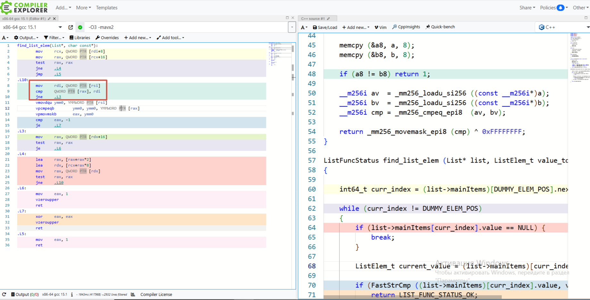
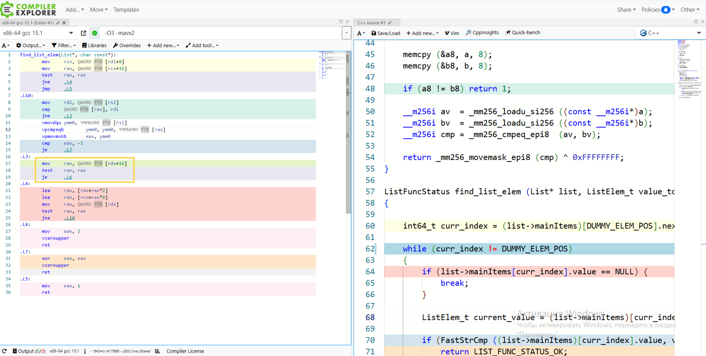

# Замеры до оптимизаций 

### GCC

| Номер измерения | Затрачено циклов       |
| :-------------: | :--------------------: |
| 1               | 166348972314           |
| 2               | 168205473829           |
| 3               | 167487261093           |
| 4               | 166945370182           |
| 5               | 167792583741           |
| 6               | 166732195408           |
| 7               | 168120459276           |
| 8               | 167508937105           |
| 9               | 166865093427           |
| 10              | 167999284361           |
| 11              | 166431289754           |
| 12              | 167624905139           |
| 13              | 167191438652           |
| 14              | 167812059348           |
| 15              | 166753761284           |

среднее: $1.6685 \cdot 10^{11}$ 

стандартное отклонение: $\sigma = 6.0 \cdot 10^{8}$

cлучайная погрешность: $\Delta t \approx  1.55 \cdot 10^{8}$
                                                            
результат: $(1.6685 \pm 0.0016) \cdot 10^{11}$

Относительная погрешность: $\frac{0.0016}{0.0016} \cdot 100\\%  \approx  0.35\\%$


### CLANG

| Номер измерения | Затрачено циклов       |
| :-------------: | :--------------------: |
| 1               | 167201234567           |
| 2               | 167654321890           |
| 3               | 167345678901           |
| 4               | 167432198765           |
| 5               | 167890123456           |
| 6               | 167543210987           |
| 7               | 167167890123           |
| 8               | 167890456789           |
| 9               | 168111111222           |
| 10              | 167852349876           |
| 11              | 168724567890           |
| 12              | 168462345123           |
| 13              | 167876543210           |
| 14              | 167345678234           |
| 15              | 166431289754          |


среднее: $1,6649 \cdot 10^{11}$

cреднее значение:  
  $$\bar{t} = 1.6649 \cdot 10^{11} \text{ циклов}$$  

cтандартное отклонение:  
  $$\sigma = 7.12 \cdot 10^{8} \text{ циклов}$$  

cлучайная погрешность:  
  $$\Delta t = 1.625 \cdot \frac{5.12 \cdot 10^8}{\sqrt{15}} \approx 2.83 \cdot 10^{8}$$  

итоговый результат
$$(1.6649 \pm 0023) \cdot 10^{11} \text{ циклов}$$  

относительная погрешность
$$\frac{0.0023}{1.6649} \cdot 100\\% \approx 0.22\\%$$  


# Замеры по оптимизации STRCMP 

## на NASN

### GCC

| Номер измерения | Затрачено циклов       |
| :-------------: | :--------------------: |
| 1               | $ 80594675223 $ |
| 2               | $ 80148167030 $ |
| 3               | $ 80654635573 $ |
| 4               | $ 80482465430 $ |
| 5               | $ 80413242575 $ |
| 6               | $ 80510376361 $ |
| 7               | $ 80380078090 $ |
| 8               | $ 81049824749 $ |
| 9               | $ 80174122140 $ |
| 10              | $ 80495906086 $ |
| 11              | $ 80443826287 $ |
| 12              | $ 80418763705 $ |
| 13              | $ 80779517344 $ |
| 14              | $ 80425303172 $ |
| 15              | $ 80449258215 $ |


**Среднее значение:**
$$ \bar{t} = 8.0464 \cdot 10^{10} \text{ циклов} $$

**Стандартное отклонение:**
$$ \sigma = \sqrt{\frac{\sum_{i=1}^{15} (t_i - \bar{t})^2}{15}} \approx 2.05 \cdot 10^{8} \text{ циклов} $$

**Случайная погрешность:**
$$ \Delta t = 2.145 \cdot \frac{2.05 \cdot 10^8}{\sqrt{15}} \approx 1.14 \cdot 10^{8} \text{ циклов} $$

**Итоговый результат:**
$$ (8.0764 \pm 0.0114) \cdot 10^{10} \text{ циклов} $$

**Относительная погрешность:**
$$ \frac{0.0114}{8.0464} \cdot 100\% \approx 0.14\% $$


### CLANG

| Номер измерения | Затрачено циклов       |
| :-------------: | :--------------------: |
| 1               | $ 80466380765 $ |
| 2               | $ 80692083147 $ |
| 3               | $ 80679406975 $ |
| 4               | $ 80570392260 $ |
| 5               | $ 80365863507 $ |
| 6               | $ 80315083288 $ |
| 7               | $ 80401316268 $ |
| 8               | $ 80597388379 $ |
| 9               | $ 80672861498 $ |
| 10              | $ 80357382749 $ |
| 11              | $ 80932077209 $ |
| 12              | $ 80201072671 $ |
| 13              | $ 80266649338 $ |
| 14              | $ 80745084367 $ |
| 15              | $ 80301926188 $ |


### Результаты измерений

**Среднее значение:**
$$ \bar{t} = 8.0506 \cdot 10^{10} \text{ циклов} $$

**Стандартное отклонение:**
$$ \sigma = \sqrt{\frac{\sum_{i=1}^{15} (t_i - \bar{t})^2}{15}} \approx 1.76 \cdot 10^{8} \text{ циклов} $$

**Случайная погрешность:**
$$ \Delta t = 2.145 \cdot \frac{1.76 \cdot 10^8}{\sqrt{15}} \approx 0.975 \cdot 10^{8} \text{ циклов} $$

**Итоговый результат:**
$$ (8.0506 \pm 0.00975) \cdot 10^{10} \text{ циклов} $$

**Относительная погрешность:**
$$ \frac{0.00975}{8.0506} \cdot 100\% \approx 0.121\% $$

## на Интринсиках 

### CLANG

| Номер измерения | Затрачено циклов       |
| :-------------: | :--------------------: |
| 1               | $ 79448410028 $ |
| 2               | $ 79618698015 $ |
| 3               | $ 79267670576 $ |
| 4               | $ 79626244963 $ |
| 5               | $ 79368336314 $ |
| 6               | $ 79176424074 $ |
| 7               | $ 79321943226 $ |
| 8               | $ 79163652520 $ |
| 9               | $ 79349711398 $ |
| 10              | $ 79195375993 $ |
| 11              | $ 79398603150 $ |
| 12              | $ 79178045156 $ |
| 13              | $ 79602168132 $ |
| 14              | $ 79514861034 $ |
| 15              | $ 78977766114 $ |


**Среднее значение:**
$$ \bar{t} = 7.9356 \cdot 10^{10} \text{ циклов} $$

**Стандартное отклонение:**
$$ \sigma = \sqrt{\frac{\sum_{i=1}^{15} (t_i - \bar{t})^2}{15}} \approx 1.91 \cdot 10^{8} \text{ циклов} $$

**Случайная погрешность:**
$$ \Delta t = 2.145 \cdot \frac{1.91 \cdot 10^8}{\sqrt{15}} \approx 1.06 \cdot 10^{8} \text{ циклов} $$

**Итоговый результат:**
$$ (7.9356 \pm 0.0106) \cdot 10^{10} \text{ циклов} $$

**Относительная погрешность:**
$$ \frac{0.0106}{7.9356} \cdot 100\% \approx 0.13\% $$


### GCC

| Номер измерения | Затрачено циклов       |
| :-------------: | :--------------------: |
| 1               | $ 79457383877 $ |
| 2               | $ 79262597902 $ |
| 3               | $ 79244929505 $ |
| 4               | $ 79256378070 $ |
| 5               | $ 79694363908 $ |
| 6               | $ 79451660351 $ |
| 7               | $ 79469975359 $ |
| 8               | $ 79317439388 $ |
| 9               | $ 79154320380 $ |
| 10              | $ 81309774029 $ |
| 11              | $ 79280512834 $ |
| 12              | $ 79461186946 $ |
| 13              | $ 79206659280 $ |
| 14              | $ 79222915005 $ |
| 15              | $ 79207654058 $ |


**Среднее значение:**
$$ \bar{t} = 7.9419 \cdot 10^{10} \text{ циклов} $$

**Стандартное отклонение:**
$$ \sigma = \sqrt{\frac{\sum_{i=1}^{15} (t_i - \bar{t})^2}{15}} \approx 5.97 \cdot 10^{8} \text{ циклов} $$

**Случайная погрешность:**
$$ \Delta t = 2.145 \cdot \frac{5.97 \cdot 10^8}{\sqrt{15}} \approx 3.31 \cdot 10^{8} \text{ циклов} $$

**Итоговый результат:**
$$ (7.9419 \pm 0.0331) \cdot 10^{10} \text{ циклов} $$

**Относительная погрешность:**
$$ \frac{0.0331}{7.9419} \cdot 100\% \approx 0.42\% $$  


# Встроенный в C ассемблер

### GCC


| Номер измерения | Затрачено циклов       |
| :-------------: | :--------------------: |
| 1               | $ 76446396440 $ |
| 2               | $ 76902159902 $ |
| 3               | $ 76218511566 $ |
| 4               | $ 77824002362 $ |
| 5               | $ 76447555063 $ |
| 6               | $ 76486760050 $ |
| 7               | $ 76006396118 $ |
| 8               | $ 76204651966 $ |
| 9               | $ 76226166480 $ |
| 10              | $ 76344504584 $ |
| 11              | $ 76525995158 $ |
| 12              | $ 76207050261 $ |
| 13              | $ 76400651365 $ |
| 14              | $ 76265272799 $ |
| 15              | $ 76160509105 $ |


**Среднее значение:**  
$$\bar{t} = \frac{\sum_{i=1}^{15} t_i}{15} \approx 7.6426 \cdot 10^{10} \text{ циклов}$$  

**Стандартное отклонение:**  
$$\sigma = \sqrt{\frac{\sum_{i=1}^{15} (t_i - \bar{t})^2}{15}} \approx 4.27 \cdot 10^{8} \text{ циклов}$$  

**Случайная погрешность:**  
$$\Delta t = 2.145 \cdot \frac{4.27 \cdot 10^8}{\sqrt{15}} \approx 2.36 \cdot 10^{8} \text{ циклов}$$  

**Итоговый результат:**  
$$(7.6426 \pm 0.0236) \cdot 10^{10} \text{ циклов}$$  

**Относительная погрешность:**  
$$\frac{0.0236}{7.6426} \cdot 100\\% \approx 0.31\\%$$ 


# Intrinsic функции


## crc32_hash()

### GCC


| Номер измерения | Затрачено циклов       |
| :-------------: | :--------------------: |
| 1               | $ 71849031601 $ |
| 2               | $ 72135082514 $ |
| 3               | $ 72385521939 $ |
| 4               | $ 71469125397 $ |
| 5               | $ 71702074333 $ |
| 6               | $ 71980243987 $ |
| 7               | $ 72372260822 $ |
| 8               | $ 72047771310 $ |
| 9               | $ 71881145682 $ |
| 10              | $ 72223876952 $ |
| 11              | $ 71648416196 $ |
| 12              | $ 71920774902 $ |
| 13              | $ 71657448934 $ |
| 14              | $ 71852651706 $ |
| 15              | $ 71990112003 $ |


**Среднее значение:**
$$\bar{t} = 7.1946 \cdot 10^{10} \text{ циклов}$$

**Стандартное отклонение:**
$$\sigma = \sqrt{\frac{\sum_{i=1}^{15} (t_i - \bar{t})^2}{15}} \approx 2.58 \cdot 10^{8} \text{ циклов}$$

**Случайная погрешность:**
$$\Delta t = 2.145 \cdot \frac{2.58 \cdot 10^8}{\sqrt{15}} \approx 1.43 \cdot 10^{8} \text{ циклов}$$

**Итоговый результат:**
$$(7.1946 \pm 0.0143) \cdot 10^{10} \text{ циклов}$$

**Относительная погрешность:**
$$\frac{0.0143}{7.1946} \cdot 100\\% \approx 0.20\\%$$

### CLANG

| Номер измерения | Затрачено циклов       |
| :-------------: | :--------------------: |
| 1               | $ 69849031602 $ |
| 2               | $ 69135082514 $ |
| 3               | $ 72385521936 $ |
| 4               | $ 71469125397 $ |
| 5               | $ 69702074337 $ |
| 6               | $ 71980243987 $ |
| 7               | $ 69372260822 $ |
| 8               | $ 72047771318 $ |
| 9               | $ 71881145682 $ |
| 10              | $ 69223876952 $ |
| 11              | $ 69648416196 $ |
| 12              | $ 69920774904 $ |
| 13              | $ 71657448933 $ |
| 14              | $ 69852651702 $ |
| 15              | $ 79990112007 $ |


**Среднее значение:**
$$\bar{t} = 7.1267 \cdot 10^{10} \text{ циклов}$$

**Стандартное отклонение:**
$$\sigma = \sqrt{\frac{\sum_{i=1}^{15} (t_i - \bar{t})^2}{15}} \approx 2.91 \cdot 10^{9} \text{ циклов}$$

**Случайная погрешность:**
$$\Delta t = 2.145 \cdot \frac{2.91 \cdot 10^9}{\sqrt{15}} \approx 1.61 \cdot 10^{9} \text{ циклов}$$

**Итоговый результат:**
$$(7.1267 \pm 0.161) \cdot 10^{10} \text{ циклов}$$

**Относительная погрешность:**
$$\frac{0.161}{7.1267} \cdot 100\\% \approx 2.26\\%$$


## intrinsic_crc32

### GCC:

| Номер измерения | Затрачено циклов       |
| :-------------: | :--------------------: |
| 1               | $ 41561471951 $ |
| 2               | $ 42974735365 $ |
| 3               | $ 41619583690 $ |
| 4               | $ 41565851186 $ |
| 5               | $ 41560697548 $ |
| 6               | $ 41534761521 $ |
| 7               | $ 41653175126 $ |
| 8               | $ 41893073815 $ |
| 9               | $ 41887786066 $ |
| 10              | $ 41714428027 $ |
| 11              | $ 41540630142 $ |
| 12              | $ 41631502816 $ |
| 13              | $ 41670486601 $ |
| 14              | $ 41665490993 $ |
| 15              | $ 41541879976 $ |


**Среднее значение:**
$$\bar{t} = 4.1696 \cdot 10^{10} \text{ циклов}$$

**Стандартное отклонение:**
$$\sigma = \sqrt{\frac{\sum_{i=1}^{15} (t_i - \bar{t})^2}{15}} \approx 3.84 \cdot 10^{8} \text{ циклов}$$

**Случайная погрешность:**
$$\Delta t = 2.145 \cdot \frac{3.84 \cdot 10^8}{\sqrt{15}} \approx 2.13 \cdot 10^{8} \text{ циклов}$$

**Итоговый результат:**
$$(4.1696 \pm 0.0213) \cdot 10^{10} \text{ циклов}$$

**Относительная погрешность:**
$$\frac{0.0213}{4.1696} \cdot 100\\% \approx 0.51\\%$$


### CLANG

| Номер измерения | Затрачено циклов       |
| :-------------: | :--------------------: |
| 1               | $ 37841074848 $ |
| 2               | $ 37838361574 $ |
| 3               | $ 37579707347 $ |
| 4               | $ 38069473953 $ |
| 5               | $ 37695294886 $ |
| 6               | $ 37877909559 $ |
| 7               | $ 37690792661 $ |
| 8               | $ 37779113608 $ |
| 9               | $ 37828581315 $ |
| 10              | $ 37965914743 $ |
| 11              | $ 38442885350 $ |
| 12              | $ 37786733434 $ |
| 13              | $ 38496975583 $ |
| 14              | $ 37745750825 $ |
| 15              | $ 37366222781 $ |


**Среднее значение:**
$$\bar{t} = 3.7824 \cdot 10^{10} \text{ циклов}$$

**Стандартное отклонение:**
$$\sigma = \sqrt{\frac{\sum_{i=1}^{15} (t_i - \bar{t})^2}{15}} \approx 2.91 \cdot 10^{8} \text{ циклов}$$

**Случайная погрешность:**
$$\Delta t = 2.145 \cdot \frac{2.91 \cdot 10^8}{\sqrt{15}} \approx 1.61 \cdot 10^{8} \text{ циклов}$$

**Итоговый результат:**
$$(3.7824 \pm 0.0161) \cdot 10^{10} \text{ циклов}$$

**Относительная погрешность:**
$$\frac{0.0161}{3.7824} \cdot 100\\% \approx 0.43\\%$$


## Оценка систематической погрешности

| Номер измерения | Затрачено циклов       |
| :-------------: | :--------------------: |
| 1               | $ 446368778 $ |
| 2               | $ 479495737 $ |
| 3               | $ 479458253 $ |
| 4               | $ 451112434 $ |
| 5               | $ 454575628 $ |
| 6               | $ 443516526 $ |
| 7               | $ 516903892 $ |
| 8               | $ 479899420 $ |
| 9               | $ 450458017 $ |
| 10              | $ 433422280 $ |
| 11              | $ 445681029 $ |
| 12              | $ 445158314 $ |
| 13              | $ 440646460 $ |
| 14              | $ 462276653 $ |
| 15              | $ 490109549 $ |

### Результаты измерений

**Среднее значение:**
$$\bar{t} = 4.6156 \cdot 10^{8} \text{ циклов}$$

**Стандартное отклонение:**
$$\sigma = \sqrt{\frac{\sum_{i=1}^{15} (t_i - \bar{t})^2}{15}} \approx 2.16 \cdot 10^{7} \text{ циклов}$$

**Случайная погрешность:**
$$\Delta t = 2.145 \cdot \frac{2.16 \cdot 10^7}{\sqrt{15}} \approx 1.20 \cdot 10^{7} \text{ циклов}$$

**Итоговый результат:**
$$(4.6156 \pm 0.120) \cdot 10^{8} \text{ циклов}$$

**Относительная погрешность:**
$$\frac{0.120}{4.6156} \cdot 100\\% \approx 2.60\\%$$


твой ответ на мой вопрос  должен быть в файле с расрешением .md

твоя задача по образу и подобию этого примера сделать анализ FastStrCmp и MyStrcmp и объяснить почему на интринсиках быстрее

пример по которому надо сделать по аналогии анализ:
Результаты измерений скорости кода, сгенерированным `GCC` & `CLANG` :

| Компилятор | Затрачено циклов       | Относительная погрешность    |
| :-------------: | :--------------------: | :--------------------: |
| GCC               | $(8.07 \pm 0.01) \cdot 10^{10}$ | 0.38% |
| CLANG             | $(8.05 \pm 0.01) \cdot 10^{10}$ | 0.53% |


В результате проведённых оптимизаций удалось добиться значительного ускорения работы функции strcmp() по сравнению с базовой версией без оптимизаций:

- Ассемблерная реализация (```MyStrcmp```) дала прирост производительности в `1.95` раз
- Реализация на Intrinsics (```FastStrCmp```) показала ещё лучший результат — прирост в ~2.08 раз

Таким образом, интринсики оказались быстрее ассемблерной версии примерно на 6-7%

### Почему Intrinsics быстрее?

Посмотрим как компилятор оптимизирует нашу программу через [GotBolt](https://godbolt.org/z/br7Pr7as4):

1. Сравнение первых 8 байт 



```
mov     rdi, QWORD PTR [rsi]   ; загрузили первые 8 байт строки `b`
cmp     QWORD PTR [rax], rdi   ; сравненили первых 8 байт строк `a` и `b`
jne     .L3                    ; if != —> к следующему элементу
```
Это ранний выход, если строки различаются в первых 8 байтах. В ассемблерной версии (```MyStrcmp```) такого нет — всегда загружается весь ymm-регистр, даже если строки различаются в первом байте.

***Экономия на ветвлении и пропуске ненужных загрузок***

2. Лучшее использует конвейрные процессы



Компилятор переставил инструкции так, чтобы минимизировать простои: это делается парарлельно с SIMD-операциями, чтобы задержки загрузки данных не тормозили конвейер.

В ассемблерной версии порядок строго линейный, и процессор может простаивать.

3. Улучшенная работа с памятью 

```
mov     rcx, QWORD PTR [rdi+8]   ; list->mainItems
lea     rdx, [rcx+rax*8]         ; вычисление адреса элемента
```

В find_list_elem компилятор предзагружает указатели: ассемблерной версии таких оптимизаций нет — каждый раз происходит полный доступ к памяти

***Меньше обращений к RAM, лучше использование кэша.***


вот мои настоящие данные которые я посчитал при компиляции на интринсиках
| Компилятор | Затрачено циклов       | Относительная погрешность    |
| :-------------: | :--------------------: | :--------------------: |
| GCC               | $(8.17 \pm 0.02) \cdot 10^{10}$ | 0.71% |

вот код измерений измеряемы на асм 
| Компилятор | Затрачено циклов       | Относительная погрешность    |
| :-------------: | :--------------------: | :--------------------: |
| GCC               | $(8.55 \pm 0.03) \cdot 10^{10}$ | 0.38% |

вот код который я засунул на на интринсиках
inline int FastStrCmp(const char* a, const char* b) 
{
    // загружаем 32 байта из каждой строки
    __m256i vec1 = _mm256_loadu_si256 ((const __m256i*)a);
    __m256i vec2 = _mm256_loadu_si256 ((const __m256i*)b);
    
    // сравниваем байты векторов
    __m256i cmp_result = _mm256_cmpeq_epi8   (vec1, vec2);
    
    // преобразуем результат сравнения в битовую маску
    unsigned int mask = _mm256_movemask_epi8 (cmp_result);
    
    // проверяем, все ли байты равны
    if ((mask ^ 0xFFFFFFFF) == 0) 
        return 0; 
        
    return 1;
}

и вот что показывает годболт (это код на инринсиках) 
find_list_elem(List*, char const*):
        mov     rcx, QWORD PTR [rdi+8]
        mov     rax, QWORD PTR [rcx+16]
        test    rax, rax
        je      .L4
.L3:
        lea     rax, [rax+rax*2]
        lea     rdx, [rcx+rax*8]
        mov     rax, QWORD PTR [rdx]
        test    rax, rax
        je      .L5
        vmovdqu ymm0, YMMWORD PTR [rsi]
        vpcmpeqb        ymm0, ymm0, YMMWORD PTR [rax]
        vpmovmskb       eax, ymm0
        cmp     eax, -1
        je      .L6
        mov     rax, QWORD PTR [rdx+16]
        test    rax, rax
        jne     .L3
.L5:
        mov     eax, 1
        vzeroupper
        ret
.L6:
        xor     eax, eax
        vzeroupper
        ret
.L4:
        mov     eax, 1
        ret


а вот код на asm 
section .text
global MyStrcmp

MyStrcmp:
    vmovdqu     ymm0,       [rdi]       
    vpcmpeqb    ymm1, ymm0, [rsi] 
    vpmovmskb   eax,  ymm1     

    xor         eax, 0xFFFFFFFF   
    jz          .equal  
              
    mov         eax, 1            
    ret

.equal:
    xor         eax, eax          
    ret
проанализируй и сделай такойже анализ как в примере